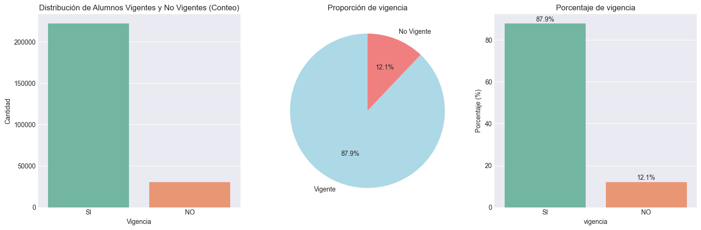
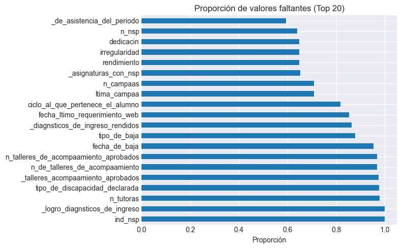
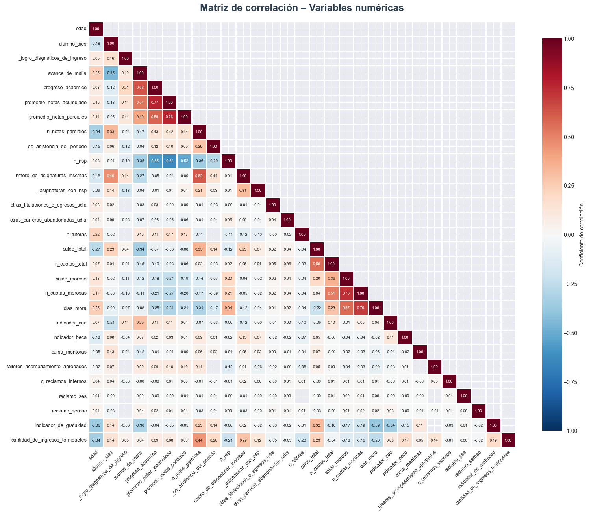
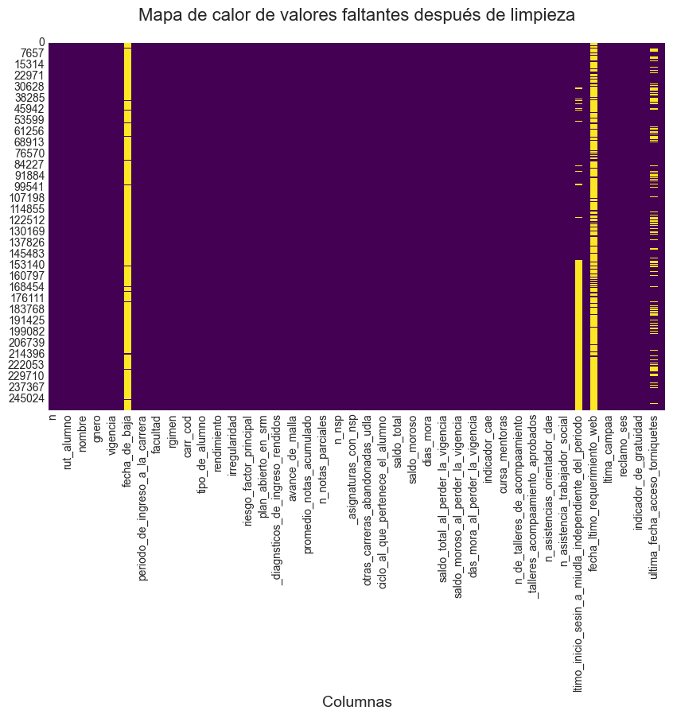
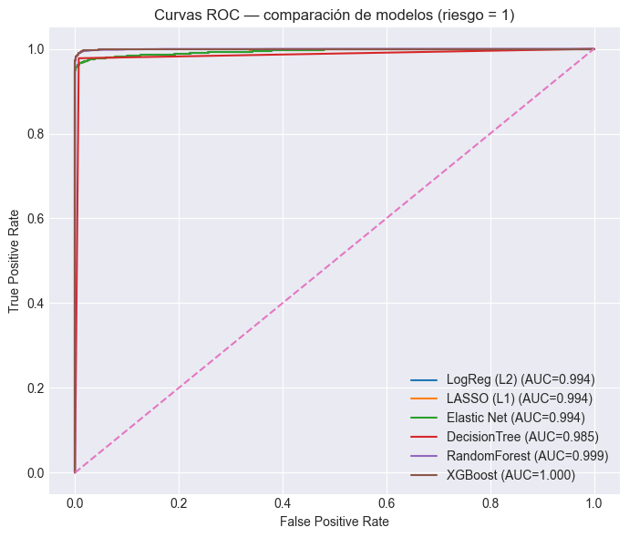
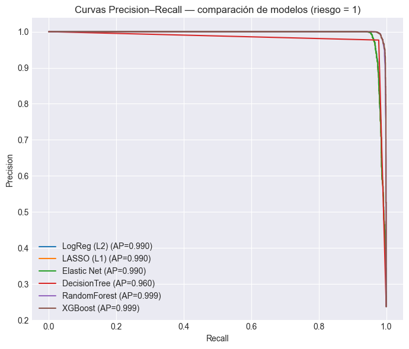
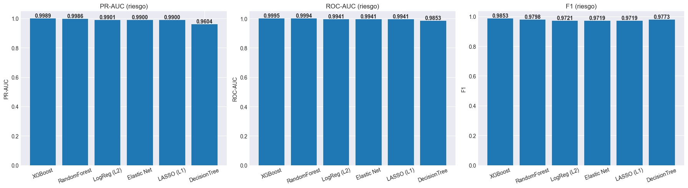
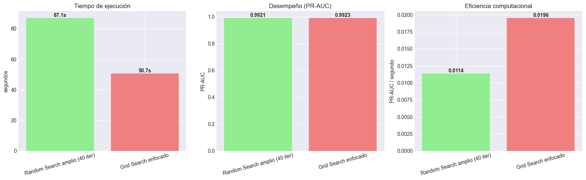
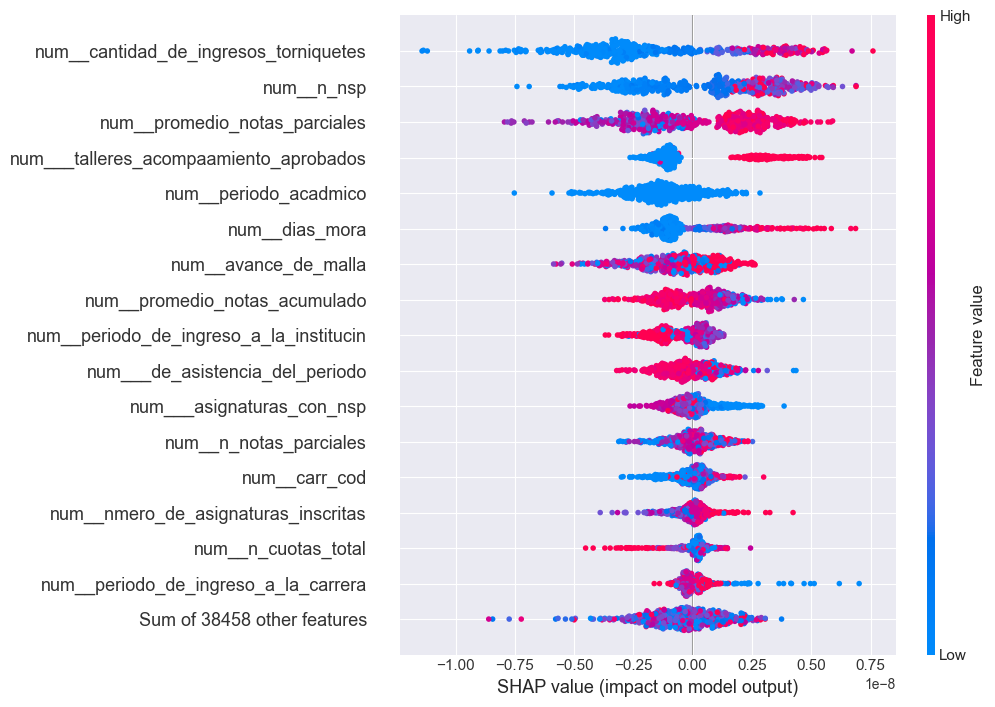
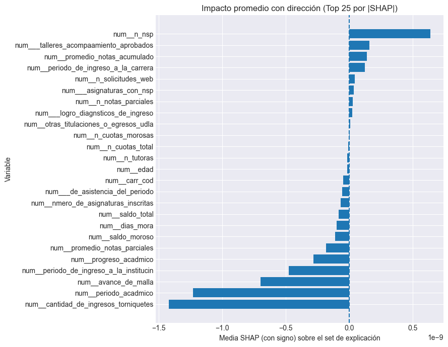

# 📊 Predicción de Retención y Riesgo de Deserción Estudiantil  
### Machine Learning aplicado a Educación Superior

## 📌 Descripción general
Este repositorio contiene el desarrollo completo de un proyecto de **Ciencia de Datos y Machine Learning** orientado a **predecir el riesgo de deserción estudiantil** en educación superior, utilizando información académica, administrativa y financiera proveniente de registros institucionales históricos.

El problema se aborda como una **tarea de clasificación supervisada binaria**, donde el objetivo es estimar la **probabilidad de que un estudiante abandone la institución** (*riesgo = 1*), permitiendo apoyar de forma temprana la toma de decisiones en estrategias de retención.

---

## 🎯 Objetivo del proyecto
Desarrollar y evaluar modelos predictivos capaces de:
- Identificar estudiantes con **alto riesgo de abandono**.
- Priorizar intervenciones institucionales de acompañamiento académico y psicosocial.
- Analizar el impacto de variables clave mediante técnicas de **interpretabilidad (SHAP)**.

---

## 🧠 Enfoque metodológico
El proyecto sigue un flujo estándar de *Machine Learning* reproducible:

1. **Análisis exploratorio de datos (EDA)**
2. **Limpieza y preprocesamiento**
3. **Definición de variable objetivo (riesgo de deserción)**
4. **Entrenamiento y comparación de modelos**
5. **Evaluación con métricas adecuadas para clases desbalanceadas**
6. **Interpretabilidad y análisis crítico**
7. **Propuesta de despliegue y monitoreo**

Todo el preprocesamiento y modelado se implementa mediante **pipelines**, evitando fuga de información y asegurando consistencia entre entrenamiento y evaluación.

---

## 📊 Análisis exploratorio de datos

### Distribución de la variable objetivo
Se observa un **fuerte desbalance de clases**, donde aproximadamente un **12%** de los estudiantes corresponde a casos de *No Vigente* (riesgo).

---

### Valores faltantes
Se analizó la proporción de valores faltantes por variable, identificando atributos con alta tasa de ausencia y justificando estrategias de imputación dentro del pipeline.

---

### Correlación entre variables numéricas
El análisis de correlación permitió detectar relaciones esperables entre desempeño académico, avance curricular y variables financieras, así como multicolinealidad moderada.

---

### Valores faltantes tras limpieza
Luego del proceso de limpieza y tipificación, se verifica una estructura de datos consistente para el modelado.

---

## 🤖 Modelos evaluados
Se entrenaron y compararon los siguientes clasificadores:

- Regresión Logística (L2)
- LASSO (L1)
- Elastic Net
- Árbol de Decisión
- Random Forest
- XGBoost

Las métricas utilizadas fueron:
- **ROC-AUC**
- **PR-AUC** (métrica prioritaria por desbalance)
- **F1-score**

---

## 📈 Resultados comparativos

### Curvas ROC

### Curvas Precision–Recall

---

### Comparación de métricas

Los modelos basados en **ensambles de árboles**, particularmente **XGBoost**, presentan el mejor desempeño global, especialmente en PR-AUC, lo que resulta clave para minimizar falsos negativos (estudiantes en riesgo no detectados).

---

## ⏱️ Eficiencia computacional y tuning
Se comparó **Random Search amplio** vs **Grid Search enfocado**, evaluando desempeño y costo computacional.

---

## 🔎 Interpretabilidad del modelo (SHAP)

### Importancia global de variables

### Impacto promedio con dirección

Las variables asociadas a **asistencia**, **avance de malla**, **rendimiento académico** y **comportamiento financiero** muestran el mayor impacto en la probabilidad de deserción.

---

## 🧩 Análisis crítico
- Existe un **trade-off entre desempeño e interpretabilidad**: XGBoost maximiza la precisión, mientras que los modelos lineales facilitan la explicación.
- El costo institucional de un **falso negativo** justifica priorizar métricas como PR-AUC y Recall.
- El modelo debe utilizarse como **herramienta de apoyo**, no como sistema automático de decisión.

---

## 🚀 Propuesta de despliegue
- Scoring periódico de estudiantes activos.
- Listas priorizadas de riesgo para equipos académicos.
- Monitoreo continuo de métricas y detección de *concept drift*.
- Reentrenamiento semestral del modelo.

---

## ⚠️ Riesgos y consideraciones éticas
- **Sesgo algorítmico**: revisión periódica y análisis de equidad.
- **Privacidad de datos**: uso responsable y acceso restringido.
- **Drift temporal**: monitoreo y actualización continua del modelo.

---

## 📁 Estructura del repositorio
